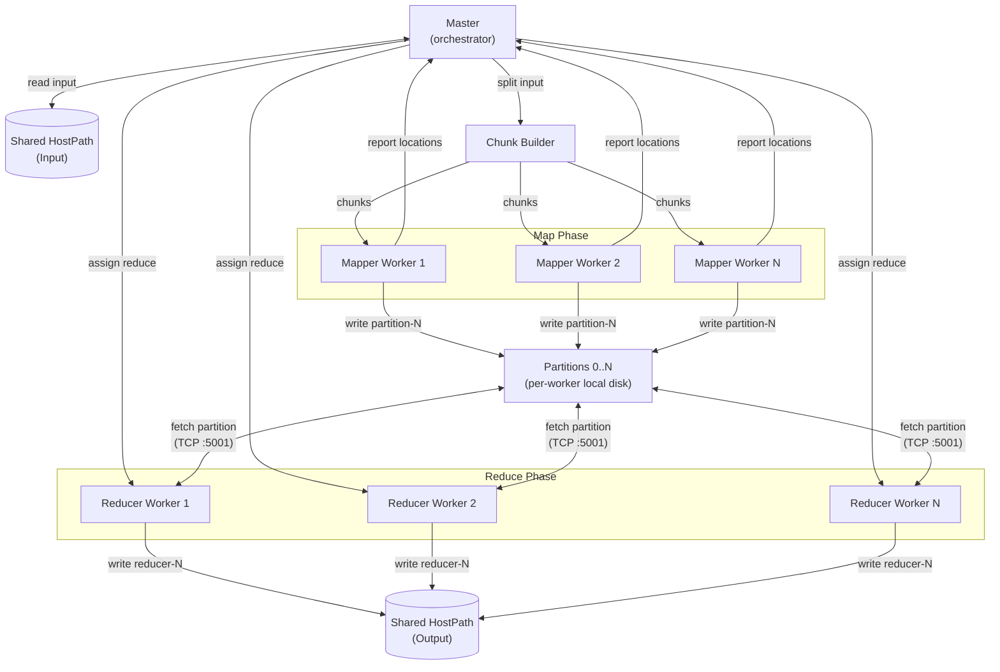
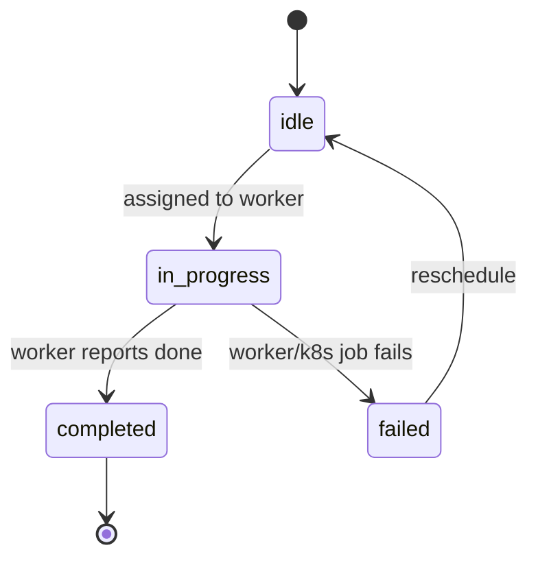
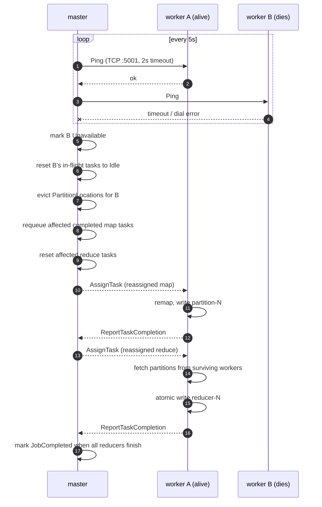

# shuffle

a distributed mapreduce implementation in go, built for learning.

## what is mapreduce?

mapreduce is a programming model for processing large datasets in parallel across a cluster. the core idea is simple:

1. **map**: transform input data into intermediate key-value pairs
2. **shuffle**: group all values by key across all mappers
3. **reduce**: combine values for each key into a final result

the canonical example is **word count**: map splits each line into words (`key=word, value="1"`), shuffle groups by word, reduce sums the counts.

## architecture

the system runs on kubernetes (minikube) with a **single master** and a **pool of workers** communicating over tcp rpc (`net/rpc`). input and output live on shared hostpath volumes, but intermediate partition files are written to each worker's local disk and fetched by reducers over the shuffle network.



> note: the same worker pods execute both map and reduce phases — they are shown separately for clarity.

## intermediate file layout

during a job, files are written to three locations:

```
/tmp/shuffle-input/                       (host) == /data/input (pods)
├── book-0
├── book-1
├── ...
└── book-93

$TMPDIR/shuffle/<jobId>/<taskId>/         (per-worker pod's local disk)
├── partition-0
├── partition-1
├── partition-2
└── partition-N

/data/output/                             (pods) == /tmp/shuffle-output (host)
├── reducer-0
├── reducer-1
├── reducer-2
└── reducer-N
```

- **input**: the master reads the directory listing from `/data/input` (shared hostpath) to compute byte-offset splits. workers read the file bytes during map execution.
- **intermediate map output**: each mapper writes partition files under `$TMPDIR/shuffle/<jobId>/<taskId>/` on its **own pod's local disk**. the file path and the worker's `POD_IP:5001` address are reported back to the master as `PartitionLocation` records.
- **final output**: reducers fetch partition files from mapper pods over `WorkerRPC.FetchPartition` (tcp 5001), then atomically write `reducer-N` to `/data/output` (shared hostpath). output is visible on the host at `/tmp/shuffle-output`.

## task lifecycle



## components

**master** — a single coordinator that:

- registers workers and builds byte-offset splits from the input directory
- creates one map task per split and assigns tasks to idle workers via `AssignTask` rpc
- collects partition location metadata from completed mappers
- creates reduce tasks once the map phase is done
- runs a health-check loop (pings every worker on tcp port 5001 every **5s** with a **2s** timeout)
- handles worker failures by requeueing lost work and resetting affected reduce tasks

**worker** — registers with the master on startup (reading `POD_IP` and `WORKER_ID` from environment), then:

- polls the master every **2s** for available tasks
- executes map or reduce tasks and reports completion back to the master
- hosts a `WorkerRPC` server on tcp port **5001** that serves `FetchPartition` (sends partition file bytes to reducers) and `Ping` (used by the master's health check)

## fault tolerance

every **5s** the master pings all registered workers over tcp port 5001 with a **2s** timeout. a worker that does not respond is marked **`Unavailable`**. the master then repairs its state:

1. resets all of the dead worker's in-flight tasks back to **`Idle`** for reassignment
2. evicts `PartitionLocation` records pointing to the dead worker's address
3. requeues completed map tasks whose partition data was on the dead worker
4. resets only the reduce tasks whose `ReducerIdx` matches the lost partitions



### key considerations

- duplicate completions are **ignored**.
- a completion is only accepted if the task is actually **running** and came from the **right worker**.
- output is written to a **temp file and atomically renamed** no partial files ever show up as final.
- once the job is **done**, workers get no more tasks dead workers at the finish line don't trigger any recomputation.

## usage

1. **install dependencies**
   ```bash
   pip install requests beautifulsoup4
   ```

2. **download sample input**
   ```bash
   python3 scripts/download_gutenberg.py
   ```
   scrapes the top 100 books from project gutenberg and writes them as `book-0` through `book-93` into `./sample_input/`. this directory is gitignored, you must generate it yourself.

3. **deploy to minikube**
   ```bash
   cd scripts && ./deploy.sh
   ```
   starts minikube, builds the `shuffle:dev` docker image against minikube's daemon, copies `sample_input/` into the minikube node at `/tmp/shuffle-input/` (mounted as `/data/input` in pods), applies the k8s manifests (`infra/namespaces.yaml`, `master.yaml`, `worker.yaml`), and runs optional fault simulation.

4. **read the output**
   ```bash
   minikube ssh cat /tmp/shuffle-output/reducer-0
   ```
   the output lands on the minikube node at `/tmp/shuffle-output/reducer-N` (one file per reducer). each file contains json-lines of `{"key": "...", "value": "..."}`.

5. **deploy options**
   | flag | description |
   |---|---|
   | `--no-fault-sim` | skip injecting worker failures |
   | `--fault-count <n>` | number of worker pods to kill (default: 6) |
   | `--fault-interval <s>` | seconds between kills (default: 8) |

> note: GPT 5.3 Codex helped me write the deploy.sh file

## final notes
this is was my **first research-paper implementation** and i had so much fun building it. i'm just getting started in the `distrbuted systems` space and i can safely say that i love it!

learnt a lot building this project about go, distributed systems, fault-tolerance, rpc and much more. i'll will be building more infra/systems projects, reading more research papers and engineering blogs in the future to become a better software engineer.

```
built by mohammed numaan
```
