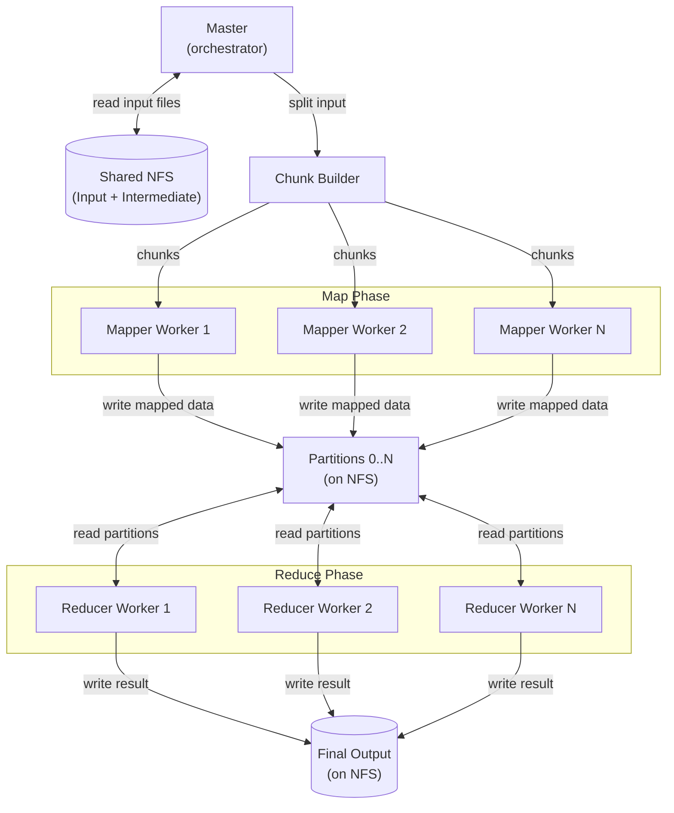
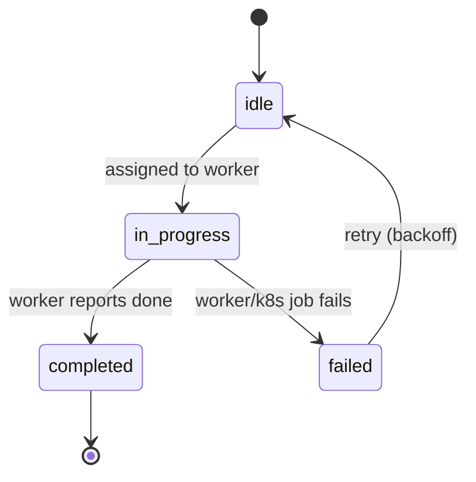

# shuffle

a distributed mapreduce implementation in go, built for learning.

## what is mapreduce?

mapreduce is a programming model for processing large datasets in parallel across a cluster. the core idea is simple:

1. **map**: transform input data into intermediate key-value pairs
2. **shuffle**: group all values by key across all mappers
3. **reduce**: combine values for each key into a final result

## architecture

## intermediate file layout

each mapper creates one output directory with partition files for each reducer. each reducer reads its assigned partition from all mapper output directories, groups by key, and produces the final result.

**Layout:**
- Map output: `mapper-{id}/partition-{partition-id}`
- Reduce input: reads all `mapper-*/partition-{assigned-id}`
- Reduce output: merged results for the assigned partition

## task lifecycle

